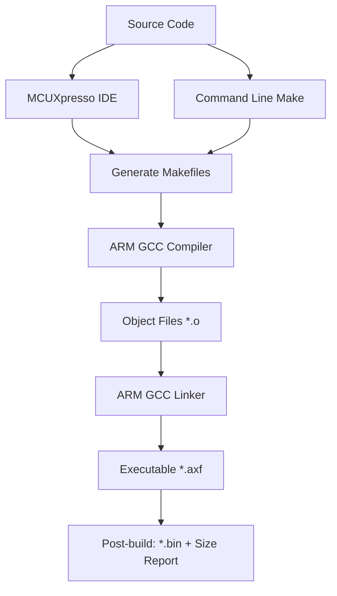

# UWB IoT Build System Guide

## Overview

The NXP UWB IoT project uses a **hybrid build system** that supports both **command-line builds** and **MCUXpresso IDE integration**. This guide explains how both approaches work and when to use each one.

## 🏗️ Build System Architecture

### Core Components

```
uwbiot-top/project/RhodesV4_SE/
├── 📄 UWBIOT_APP_BUILD.h          # Demo selection (which app to build)
├── 📄 .project                    # Eclipse/MCUXpresso project file
├── 📄 .cproject                   # CDT project configuration
├── 📄 Debug/                      # Build output directory
│   ├── makefile                   # Auto-generated main makefile
│   ├── sources.mk                 # Source file definitions
│   ├── subdir.mk files            # Per-directory build rules
│   └── *.o, *.d files             # Compiled objects & dependencies
└── 📄 *.ld                        # Linker scripts
```

### Build Flow



## 🔧 Command-Line Building

### Prerequisites

- **ARM GCC Toolchain**: `arm-none-eabi-gcc` in PATH
- **Make**: GNU Make utility
- **Python 3**: For post-build scripts

### Build Commands

```bash
# Navigate to project directory
cd uwbiot-top/project/RhodesV4_SE/Debug

# Clean build
make clean

# Build project
make

# Build with verbose output
make all

# Clean and rebuild
make clean && make all
```

### Build Targets

| Command | Description |
|---------|-------------|
| `make` | Incremental build (default target) |
| `make all` | Full build with post-processing |
| `make clean` | Remove all build artifacts |
| `make main-build` | Build executable only (no post-processing) |
| `make post-build` | Run post-build steps (size analysis, binary generation) |

### Build Outputs

```
Debug/
├── RhodesV4_SE.axf         # Main executable (ELF format)
├── RhodesV4_SE.bin         # Binary for flashing
├── RhodesV4_SE.map         # Memory map file
└── **/*.o, **/*.d          # Object files and dependencies
```

## 🖥️ MCUXpresso IDE Building

### Project Setup

1. **Import Project**:
   - File → Import → Existing Projects into Workspace
   - Select `uwbiot-top/project/RhodesV4_SE`

2. **SDK Configuration**:
   - Project uses **QN9090 SDK v2.x**
   - Automatically configured via `.cproject` file
   - SDK components: CMSIS, drivers, FreeRTOS, etc.

### Build Configuration

The IDE uses **Eclipse CDT Managed Build** system:

- **Debug Configuration**: `-O1 -g3` (optimized with debug info)
- **Release Configuration**: Higher optimization levels
- **Build Variables**: Defined in project settings
- **Include Paths**: Auto-managed from project structure

### Building in IDE

1. **Right-click project** → Build Project
2. **Project menu** → Build All
3. **Hammer icon** in toolbar
4. **Ctrl+B** keyboard shortcut

## 🔄 Build System Comparison

| Aspect | Command Line | MCUXpresso IDE |
|--------|-------------|----------------|
| **Speed** | ⚡ Fast (direct make) | 🐌 Slower (IDE overhead) |
| **Automation** | ✅ Perfect for CI/CD | ❌ Manual process |
| **Debugging** | ❌ External tools needed | ✅ Integrated debugger |
| **Code Navigation** | ❌ External editor | ✅ Full IDE features |
| **Build Customization** | ✅ Direct makefile editing | ✅ GUI configuration |
| **Error Reporting** | 📝 Terminal output | ✅ Integrated error markers |
| **Multi-platform** | ✅ Any OS with toolchain | 🖥️ IDE installation required |

## 🎯 When to Use Each Approach

### Use Command Line When:

- ✅ **CI/CD pipelines** - Automated builds
- ✅ **Batch building** - Multiple configurations
- ✅ **Scripting** - Integration with build scripts
- ✅ **Remote development** - SSH/headless environments
- ✅ **Fast iteration** - Quick compile-test cycles

### Use MCUXpresso IDE When:

- ✅ **Development** - Writing and debugging code
- ✅ **Project setup** - Initial configuration
- ✅ **Hardware debugging** - JTAG/SWD debugging
- ✅ **Code analysis** - Static analysis tools
- ✅ **Team collaboration** - Shared project settings

## ⚙️ Build System Details

### Makefile Generation

The build system uses **auto-generated makefiles**:

```bash
# Main makefile includes all subdirectories
Debug/makefile
├── includes sources.mk           # Source file lists
├── includes */subdir.mk          # Per-directory rules
└── includes ../makefile.defs     # Build definitions
```

### Compilation Process

Each source file follows this pattern:

```bash
arm-none-eabi-gcc \
  -D__APP_DEBUG -DCPU_QN9090 [... many defines ...] \
  -I../../../my_custom_app/inc [... many includes ...] \
  -O1 -g3 -Wall -mcpu=cortex-m4 -mthumb \
  -o "my_custom_app/src/my_app_main.o" \
  "/path/to/my_custom_app/src/my_app_main.c"
```

### Linking Process

```bash
arm-none-eabi-gcc -nostdlib \
  -Xlinker -Map="RhodesV4_SE.map" \
  -mcpu=cortex-m4 -mthumb \
  -T QN9090_UWB_TAG_FW.ld \
  -o "RhodesV4_SE.axf" \
  $(OBJS) $(LIBS)
```

### Post-Build Steps

```bash
# Generate size report
arm-none-eabi-size "RhodesV4_SE.axf"

# Create binary file
arm-none-eabi-objcopy -O binary "RhodesV4_SE.axf" "RhodesV4_SE.bin"

# Run custom image tool
python3 "../../../scripts/dk6_image_tool.py" RhodesV4_SE.axf
```

## 🐛 Troubleshooting

### Common Build Issues

1. **Missing Toolchain**:
   ```bash
   # Check if ARM GCC is in PATH
   which arm-none-eabi-gcc
   arm-none-eabi-gcc --version
   ```

2. **Make Not Found**:
   ```bash
   # Install make (macOS)
   xcode-select --install
   
   # Install make (Linux)
   sudo apt-get install build-essential
   ```

3. **Permission Issues**:
   ```bash
   # Fix file permissions
   chmod +x ../../../scripts/dk6_image_tool.py
   ```

4. **Clean Build Required**:
   ```bash
   # Force clean rebuild
   make clean && make all
   ```

### Build Performance Tips

- **Parallel Builds**: `make -j$(nproc)` (use multiple CPU cores)
- **Incremental Builds**: Only changed files recompile
- **Dependency Tracking**: `.d` files track header dependencies
- **ccache**: Use compiler cache for faster rebuilds

## 📁 Custom Application Integration

### Adding New Source Files

Your custom application files are automatically detected:

```bash
# Files in my_custom_app/ are automatically included
my_custom_app/
├── inc/*.h                    # Headers (-I../../../my_custom_app/inc)
└── src/*.c                    # Sources (compiled to *.o)
```

### Build Integration

The build system automatically:

1. **Scans** `my_custom_app/src/` for `.c` files
2. **Generates** `Debug/my_custom_app/src/subdir.mk`
3. **Compiles** each source to object files
4. **Links** objects into final executable

### Debugging Build Issues

```bash
# Check if your files are detected
ls Debug/my_custom_app/src/*.o

# View compilation commands
make -n | grep my_custom_app

# Check include paths
arm-none-eabi-gcc -E -dM - < /dev/null | grep -i path
```

## 🚀 Best Practices

### Development Workflow

1. **IDE for Development**: Use MCUXpresso for coding/debugging
2. **Command Line for Testing**: Quick builds during development
3. **CI/CD Integration**: Use command line for automated builds
4. **Version Control**: Commit source code, ignore `Debug/` folder

### Build Optimization

- **Use incremental builds** during development
- **Clean builds** for releases
- **Parallel compilation** for large projects
- **Dependency management** via makefiles

### Project Maintenance

- **Keep SDK updated** in MCUXpresso IDE
- **Sync project files** (`.project`, `.cproject`) in version control
- **Document custom build steps** in project README
- **Test both build methods** to ensure compatibility

---

## 📝 Summary

The NXP UWB IoT build system provides flexibility through its **dual-mode approach**:

- **MCUXpresso IDE**: Best for development, debugging, and project setup
- **Command Line**: Best for automation, CI/CD, and quick iterations

Both methods produce identical results, so choose based on your workflow needs. The auto-generated makefile system ensures consistency between IDE and command-line builds while supporting custom applications like our multi-session UWB implementation.
